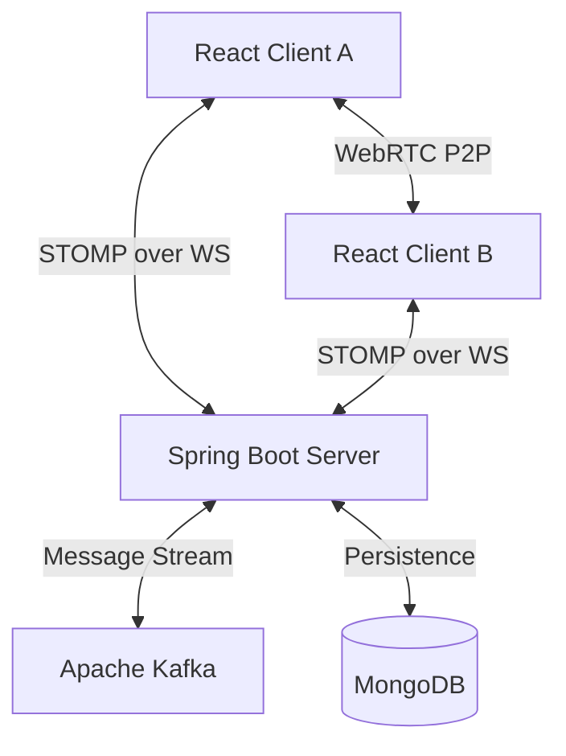

# 💻 ChatVerse – The Ultimate Real-Time Communication Platform

[](https://spring.io/projects/spring-boot)
[](https://react.dev/)
[](https://webrtc.org/)
[](https://kafka.apache.org/)
[](https://opensource.org/licenses/MIT)

**ChatVerse** is a premium, high-performance real-time communication platform built for scale and reliability. It combines the power of **Spring Boot** and **Apache Kafka** for robust messaging with **WebRTC** for seamless, low-latency video and audio calling.

---

## ✨ Features

### 🚀 Real-Time Messaging
- **Kafka-Powered**: Distributed message streaming for high availability and reliable delivery.
- **WebSocket (STOMP)**: Ultra-low latency communication for instant chat updates.
- **Presence Tracking**: Real-time online/offline status for all users.
- **Typing Indicators**: Live visual feedback when someone is typing.

### 🎥 Premium Calling (WebRTC)
- **Video & Voice Calls**: Peer-to-peer media streaming with privacy-first configurations.
- **Two-Step Handshake**: Secure "Invite -> Accept" flow ensuring camera/mic only open after approval.
- **Signal Queuing**: Intelligent handling of signaling data (ICE candidates) to ensure 99% connection success.
- **Audio-Only Mode**: Dedicated voice interface with profile avatars and zero video track usage.

### 🛡️ Core Reliability
- **Poison Pill Handling**: Robust Kafka deserialization that prevents consumer crashes from malformed data.
- **MongoDB Persistence**: Optimized schema for fast historical message retrieval.
- **File Sharing**: Integrated attachment support for images and documents.

---

## 🧑🏻‍💻 Tech Stack

| Layer | Technologies |
| :--- | :--- |
| **Frontend** | React, Vite, Tailwind CSS, STOMP.js, WebRTC API |
| **Backend** | Java 17, Spring Boot, Spring WebSocket, Apache Kafka |
| **Database** | MongoDB |
| **Infrastructure** | Docker, Docker Compose, Zookeeper |

---

## 📂 Project Structure

```text
ChatVerse/
├── ChatVerse-Backend/    # Spring Boot backend (REST + WebSockets + Kafka)
├── ChatVerse-Frontend/   # React/Vite frontend (Modern & Responsive UI)
├── docker-compose.yml    # Full-stack orchestration (Kafka, Mongo, Backend, Frontend)
└── README.md             # This documentation
```

---

## 🛠 Architecture Overview



---

## ⚙️ Installation & Setup

### 🐳 The Easy Way (Docker Compose)
Ensure you have Docker and Docker Compose installed.

```bash
docker-compose up --build
```
- **Frontend**: [http://localhost:5173](http://localhost:5173)
- **Backend API**: [http://localhost:8081](http://localhost:8081)

### 🛠 Manual Development Setup

#### 1. Infrastructure
Run only the essential services using Docker:
```bash
docker compose up mongodb kafka zookeeper -d
```

#### 2. Backend (Spring Boot)
```bash
cd ChatVerse-Backend
mvn clean install
mvn spring-boot:run
```

#### 3. Frontend (React)
```bash
cd ChatVerse-Frontend
npm install
npm run dev
```

---

## 📸 Screenshots

### **Premium Chat Interface**


### **Seamless Calling Flow**
*(Coming Soon: Updated screenshots of the new WebRTC interface)*

---

## 🤝 Contributing

Contributions make the open-source community an amazing place!
1. Fork the Project
2. Create your Feature Branch (`git checkout -b feature/AmazingFeature`)
3. Commit your Changes (`git commit -m 'Add some AmazingFeature'`)
4. Push to the Branch (`git push origin feature/AmazingFeature`)
5. Open a Pull Request

---

## 🧑‍💻 Author
**Samarth Dharpure**  
🌐 [LinkedIn](https://www.linkedin.com/in/samarth-dharpure-88a10b248/) | 💻 [GitHub](https://github.com/SamarthDharpure)

📜 **License**: MIT  
⭐ **Note**: If you find this project helpful, please give it a star!
